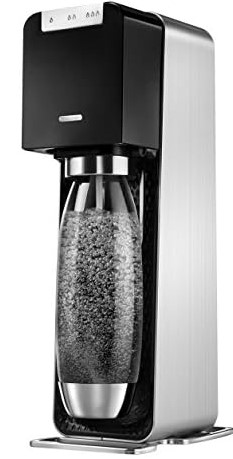
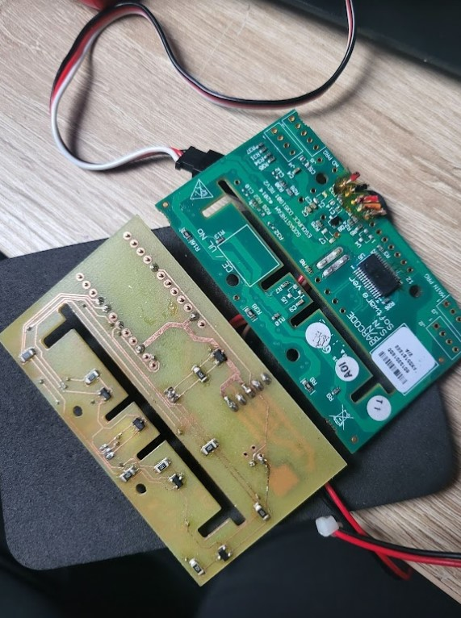
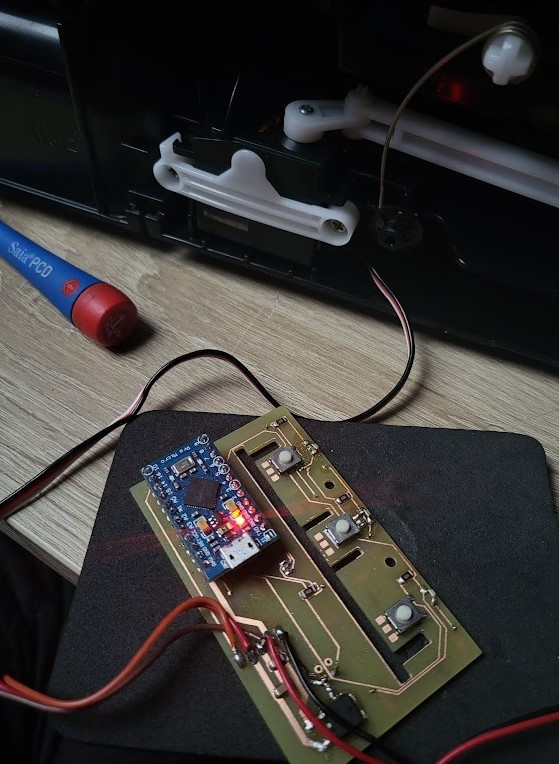
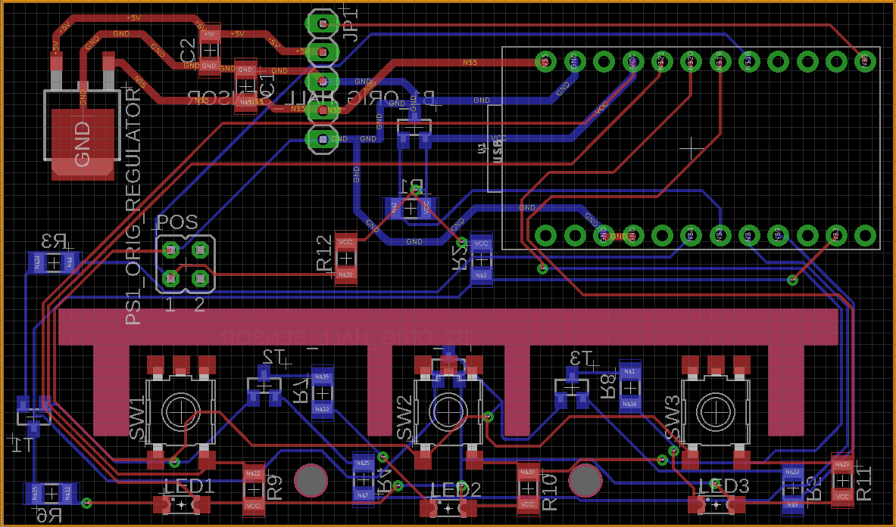
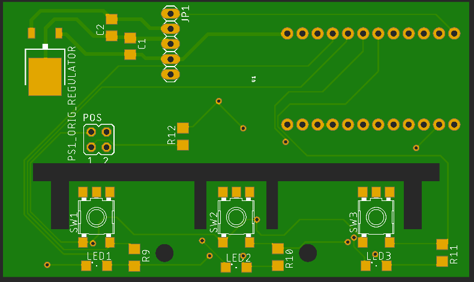

# How to fix S*daStream?
Somehow it happened that this bubbler stopped working-only the LEDs were flashing (no, a new power adapter did not help).
Attempts to repair the original control board did not work, it is simply too complicated for me. So I simply made a new PCB, radically simplified, built on an Arduino Micro and many of the original parts. Here are some data files. NO WARRANTY, FOR STUDY PURPOSES ONLY!
* The original one

* New PCB

